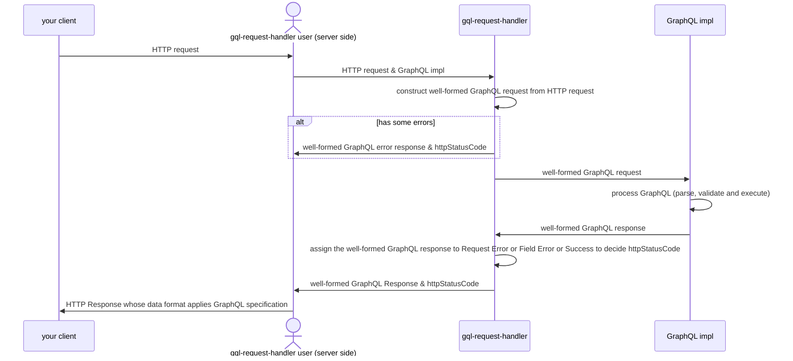

# graphql-http-handler

graphql-http-handler(ghh) is a minimal(depends on no libraries) yet practical implementation of joint between HTTP and GraphQL, compliant with the ['GraphQL Over HTTP'](https://graphql.github.io/graphql-over-http/draft/) specification.

Now follow commit hash "511b7350e671d7a608a539df488436d37e5b897e"

# Traceability check

Traceability check between GraphQL Over HTTP and ghh implementation are manually but ID based technique.
We attach specification ids to GraphQL Over HTTP specification, the result shows GitHub pages.
Attaching ids is per paragraph but not strictly.
Each id is commented in the implementation files of ghh.
If it's hard to relate to any implementation, the ids are written in specignore.json.
We run traceability test script, which tests the following:
1. All spec ids appear in spec-ignore.json or implementation files
2. All spec ids in spec-ignore.json and implementation files are defined in specification.

# Sequence

# How to handle requests

ghh receive Request and response Response.
Response body always comply with GraphQL response format.
http status would be 200, 400, 405, 406. that is follow GraphQL Over HTTP

## Get Request

| No  | Condition                                            | If false, the response is             |
| :-: | :--------------------------------------------------- | :------------------------------------ | 
| 1   | Accept contains "application/graphql-response+json"  | GraphQL request error with 400        |
| 2   | SearchParams contains parameters with correct format | GraphQL request error with 400 or 405 |
| 3   | SearchParams can be parsed by GraphQL implementation | GraphQL request error with 400        |
| 4   | SearchParams is validated by GraphQL implementation  | GraphQL request error with 400        |
| 5   | GraphQL implementation raises some field errors      | GraphQL field error with 200          |

When all conditions are true, the response is GraphQL success response with status code 200. 

## Post Request

| No  | Condition                                            | If false, the response is             |
| :-: | :--------------------------------------------------- | :------------------------------------ | 
| 1   | Accept contains "application/graphql-response+json"  | GraphQL request error with 400        |
| 2   | Content-Type is "application/json"                   | GraphQL request error with 400        |
| 3   | Request body contains parameters with correct format | GraphQL request error with 400 or 405 |
| 4   | Parameters can be parsed by GraphQL implementation   | GraphQL request error with 400        |
| 5   | Parameters are validated by GraphQL implementation   | GraphQL request error with 400        |
| 6   | GraphQL implementation raises some field errors      | GraphQL field error with 200          |

When all conditions are true, the response is GraphQL success response with status code 200. 

## Other method requests

If the request method is not GET nor POST, ghh returns 406 error.
